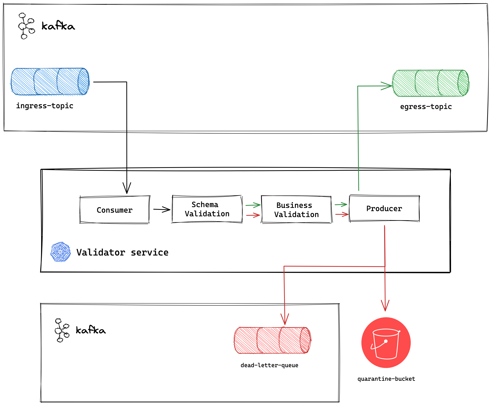

# transaction-card-validator

Main service that will handle data validation logic and message movement across topics in `eventstreaming` cluster.

## Overview



- **Schema validation**

The first step of validation is to check if `ingress` data complies to the defined message schema. This is done by defining an `goavro` Codec with the provided `Avro` schema and checking the incoming data against it. Therefore, your schema should be defined in `Avro` and registered in `schema-registry` OR added as a `model` in `internal/models/`. Once the schema is defined, you reference it in the `subject_name` parameter on the job registration in `values.yaml`.

- **Business Validation**

Here your data is going to be semantic validated against your own custom business logic. Therefore, you need to write your own custom logic validator under `internal/aplication/`. The idea is for the `validation` package to be generic enough to enable the development of all sorts of validation scripts. Once its created, reference it using the `business_validation` parameter in `values.yaml`.

- **Happy path (on green)**

If both `schema` and `business logic` validation succeeds, the message is going to be written to the `egress` topic. It is important to note here that the `business logic` step is optional and can be omitted.

- **Validation failed (on red)**

If either `schema` or `business logic` validation fails, your message is going to go to the failed route. It can either be written to a `quarantine s3 bucket` or it can be sended to a `dead-letter queue` in kafka. AT THE MOMENT, only the `s3-quarantine` route is available. In both cases, your message is **not** going to the `egress` topic.

Once the validation fails, a special log (Audit log) is going to be generated so you can watch for it. If your message is in the `dead-letter queue`, it can be picked by a different consumer to try to re-process it.

- **Alerting**

For errors and failed validation alerts are raised and sent to Slack

#tech-acquiring-datasharing-alerts-dev

#tech-acquiring-datasharing-alerts-prd

## Local development
1. Register your own validator in `charts/local/values/transaction.yaml`

2. Init stack
    ```bash
    tilt up
    ```
    At that point the `validator` service will be up and running, listening for the `ingress` topics.

3. Produce messages to the ingress topic. You can do it using a console producer or writing your own producer client to do it programatically.

4. Message will be picked up and validated.

The failed s3-route is reproduced locally with `Minio`, so you can easily inspect the failed messages. Messages will go to quarantine, emitting an Audit log for it. Object's key in the bucket follows a hive-like pattern:
```
<topic-name>/year=<year>/month=<month>/day=<day>/<unix-millisecond>.json
```

## Schema management

Ideally all the schemas should be stored in `schema-registry`. However, at the moment the application is reading the AVRO schema in an internal definition (inside `models/`). Logic to fetch it from schema-registry is already implemented, but commented out for now.

**Registered schemas in models**

| Source System | Source table/Queue | Schema Name                |
|---------------|--------------------|----------------------------|
| Way4          | DOC                | `Way4RawTransaction`       |
| Way4          | DOC                | `Way4TokenizedTransaction` |
| Solanteq      | afterProcessTxn    | `SolanteqRawTransaction`   |

When deploying the validator service, make sure to refer the `Schema Name` as the `subject_name` parameter.

## Business validators

Table with all currently implemented business logic validators

| Source System | Name                   | Description                                   |
|---------------|------------------------|-----------------------------------------------|
| Way4          | `Way4MaskedCardNumber` | Validates if card numbers are properly masked |
| PGateway      | `PGatewayValidation`   | Validates if messages don't contain CHD       |

## Chart parameters

### Common Parameters

| Name               | Description                                                          | Value     |
|--------------------|----------------------------------------------------------------------|-----------|
| `environment`      | Environment of execution, preferrably overwritten by deployment.yaml | `"dev"`   |
| `deployment.local` | Deployment tag for local usage                                       | `"false"` |

### Validator Parameters

| Name                                     | Description                                                             | Value    |
|------------------------------------------|-------------------------------------------------------------------------|----------|
| `validator.services.name`                | Name of your validator deployment                                       | `""`     |
| `validator.services.replicaCount`        | Number of consumer and producer instances                               | `""`     |
| `validator.services.ingress_topic`       | Name of ingress kafka topic                                             | `""`     |
| `validator.services.egress_topic`        | Name of egress kafka topic                                              | `""`     |
| `validator.services.ingress_msk_secret`  | Reference to the secret that holds kafka credentials, for ingress topic | `""`     |
| `validator.services.egress_msk_secret`   | Reference to the secret that holds kafka credentials, for ingress topic | `""`     |
| `validator.services.subject_name`        | Schema reference on schema-registry or name in `models`                 | `""`     |
| `validator.services.s3_bucket`           | Quarantine bucket to store failed messages                              | `""`     |
| `validator.services.card_hold_keys`      | Specific parameter for processing card hold data                        | `""`     |
| `validator.services.subject_name`        | Schema reference on schema-registry or name in `models`                 | `""`     |
| `validator.services.skip_validation`     | Boolean value to turn on and off schema validation                      | `false`  |
| `validator.services.business_validation` | Name of business validator in `application`                             | `"none"` |
| `validator.services.pause_processing`    | Boolean flag to stop consuming messages from ingress topic              | `false`  |
| `validator.services.customEnv`           | Mapping to addition env variables that validator script might need      | `{}`     |